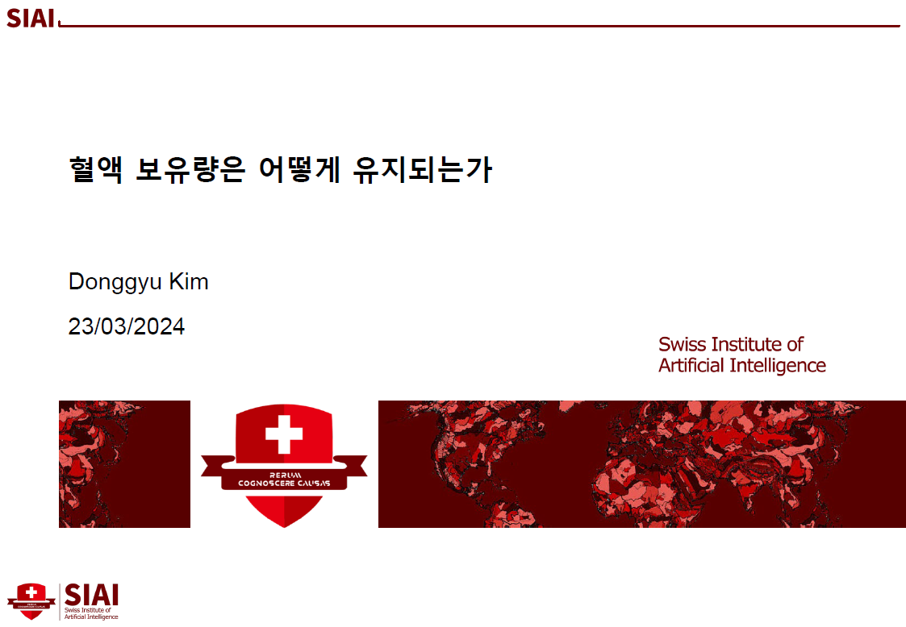

## Summary

- 혈액 보유량 유지 요인 파악

## Period

(2023.08 ~ 2024.04)

## Tasks

- “혈액관리기본계획”에 의한 “혈액 수급 위기단계별 대응”의 동작 여부 확인
- “혈액 보유량”, “혈액 공급량”, “혈액 사용량”간 관계 분석
- “혈액 공급량” 증가 요인과 효과 분석
- “헌혈”에 있어서 지역, 성별 그룹간의 차이 분석

## Project files
- [Yearly data EDA](analysis_main.ipynb)
- [Analysis](analysis_main.ipynb)